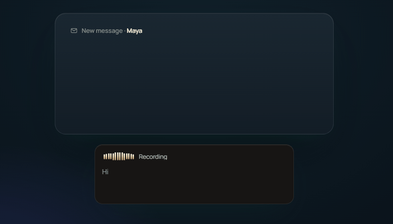

<div align="center">

<picture>
  <source media="(prefers-color-scheme: dark)" srcset="Logo/final/lockup-dark.svg" />
  
</picture>

### You think faster than you type.

**A free, local voice assistant for your desktop. Dictation, writing, and an AI assistant, all by voice.**

[](LICENSE)
[](#install)
[](https://tauri.app)

[Download](https://github.com/AbhishekBarali/SpeakoFlow/releases) &nbsp;·&nbsp; [Website](https://www.speakoflow.com) &nbsp;·&nbsp; [Discussions](https://github.com/AbhishekBarali/SpeakoFlow/discussions)



</div>

---

## Contents

- [What is SpeakoFlow?](#what-is-speakoflow)
- [Features](#features)
- [Default hotkeys](#default-hotkeys)
- [Install](#install)
- [Build from source](#build-from-source)
- [Tech stack](#tech-stack)
- [Privacy](#privacy)
- [Troubleshooting](#troubleshooting)
- [Roadmap](#roadmap)
- [Contributing](#contributing)
- [License](#license)
- [Credits](#credits)

## What is SpeakoFlow?

SpeakoFlow turns your voice into text, right where you're working. Press a hotkey and talk, and your words are typed into whatever app you're using. Say "Hey Flow" to turn what you say into a finished reply or email, or open a floating assistant panel to chat by voice and get answers read back to you.

Speech-to-text runs locally on your machine, so your voice never leaves your device. The AI assistant runs on any model you choose, from a fully offline built-in model to your own local server or a cloud provider with your own key. You decide how much stays on your machine.

## Features

- **Dictation.** Press a hotkey and talk. Words type into any app, live as you speak or all at once when you stop. Transcription runs on your GPU or CPU.
- **Generate with Flow.** Begin a dictation with "Hey Flow" and it writes the reply, email, or draft and pastes it for you. The trigger phrase is renameable.
- **Translate.** Speak another language and get clean English, on your device, with a Whisper model.
- **AI cleanup.** Strip filler and fix grammar in a tone you choose: Professional, Friendly, Concise, or your own.
- **Assistant panel.** A floating chat you open with a hotkey. Ask by voice or text, get streaming answers, and have them read back aloud.
- **Screen vision.** Ask about what's on your screen and the assistant answers with that context. It only looks when you ask it to.
- **Web search.** Optional. The assistant can look things up for current, factual answers.
- **Profiles.** Switch the assistant between personas, each with its own voice and reply length.
- **Personal memory.** Optional, on-device memory so the assistant learns how you like to work. Off until you turn it on.

Everything lives in Settings, and every hotkey is rebindable.

## Default hotkeys

| Action            | Windows                  | macOS                   | Linux                |
| ----------------- | ------------------------ | ----------------------- | -------------------- |
| Dictate           | `Left Ctrl + Left Super` | `Option + Space`        | `Ctrl + Space`       |
| Ask the assistant | `Left Ctrl + Left Alt`   | `Option + Ctrl + Space` | `Ctrl + Alt + Space` |

Hold to talk, or tap `Space` while holding to keep recording hands-free. All shortcuts are configurable in Settings.

## Install

Download the latest build for Windows, macOS, or Linux from the [Releases](https://github.com/AbhishekBarali/SpeakoFlow/releases) page. A short setup wizard helps you pick a transcription model and, optionally, a local model for the assistant.

To use the assistant, choose a provider in Settings:

- **Built-in (offline).** Download a small local model and run it fully on your machine, no key needed.
- **Local server.** Point SpeakoFlow at Ollama or LM Studio.
- **Cloud.** Bring your own API key for any OpenAI-compatible provider.

## Build from source

Requires [Rust](https://rustup.rs/) and [Bun](https://bun.sh/).

```bash
git clone https://github.com/AbhishekBarali/SpeakoFlow.git
cd SpeakoFlow
bun install
mkdir -p src-tauri/resources/models
curl -o src-tauri/resources/models/silero_vad_v4.onnx https://blob.handy.computer/silero_vad_v4.onnx
bun run tauri dev
```

See [BUILD.md](BUILD.md) for platform-specific setup.

## Tech stack

- **App:** [Tauri 2](https://tauri.app) with a Rust backend and a React and TypeScript frontend.
- **Speech-to-text:** whisper.cpp and Parakeet with GPU acceleration, plus Silero VAD for voice detection.
- **Assistant:** a built-in llama.cpp engine, or any OpenAI-compatible provider you configure.
- **Text-to-speech:** [Kokoro](https://github.com/hexgrad/kokoro) locally, with OpenAI-compatible, ElevenLabs, and Azure options.

## Privacy

Your voice is transcribed on your device and never uploaded. The assistant only contacts the model provider you choose, which can be a fully local one. There is no telemetry and no account. Optional features like web search and personal memory are off until you turn them on, and memory is stored on your device where you can view, edit, or erase it.

## Troubleshooting

### Linux: the recording overlay won't stay on top of other apps

The recording overlay has to float above every other window. On Linux that is only possible two ways: the `wlr-layer-shell` protocol (used by wlroots compositors like Sway and Hyprland, and by KDE Plasma) or classic X11 "keep above" stacking.

**A native GNOME/Wayland session supports neither** — Mutter does not implement `wlr-layer-shell`, and Wayland gives apps no way to raise themselves above others. So under native GNOME/Wayland the overlay can't stay on top.

SpeakoFlow handles this automatically: when it detects GNOME on Wayland it runs under **XWayland**, where "keep above" works and the overlay floats normally. This is on by default and needs no setup. X11 sessions and KDE/wlroots Wayland already work out of the box.

- Force native Wayland anyway (the overlay may not stay on top): launch with `SPEAKOFLOW_ALLOW_WAYLAND=1`.
- If the overlay misbehaves under a layer-shell compositor, disable layer shell with `SPEAKOFLOW_NO_GTK_LAYER_SHELL=1`.

### Linux: hotkeys do nothing and the logs repeat "Permission denied"

If dictation and the assistant hotkeys don't respond on Linux and you see the log
repeating `rdev grab error: ... PermissionDenied` (errno 13), the app can't read
your input devices. This affects the **handy-keys** keyboard engine, which reads
`/dev/input/event*` and needs your user to be in the `input` group.

Two ways to fix it:

- **Grant access** — add your user to the `input` group, then log out and back in:

  ```bash
  sudo usermod -aG input $USER
  ```

- **Or switch engines** — set the keyboard engine to **Tauri** in Settings, which
  uses the compositor's global-shortcut API and needs no special permissions.
  (Tauri is already the default engine on Linux, so this only affects you if you
  switched to handy-keys.)

### Linux: the app crashes when you pinch-to-zoom on a touchpad

On some Linux setups a trackpad pinch-to-zoom gesture crashes the window, with
`Received invalid message: 'DrawingArea_CommitTransientZoom'` in the logs. This
is a bug in **WebKitGTK** (the Linux web engine Tauri/wry uses), not in
SpeakoFlow itself, and it affects many WebKitGTK-based apps. It is tracked
upstream in [tauri#13115](https://github.com/tauri-apps/tauri/issues/13115) and
[wry#544](https://github.com/tauri-apps/wry/issues/544).

Until there's an upstream fix, avoid the pinch-to-zoom gesture inside the app
window. Updating your system's WebKitGTK packages (`webkit2gtk-4.1`) to the
latest version can also help, since newer releases handle the gesture more
gracefully.

## Roadmap

- Code signing for Windows and macOS
- A wider model catalog and more one-click local models
- More community translations
- Voice-to-text tuned for agentic coding
- Prompt-engineering help: describe what you want to build and get a solid prompt back
- Voice commands: trigger actions and complete tasks by voice

Have an idea? Open a [Discussion](https://github.com/AbhishekBarali/SpeakoFlow/discussions).

## Contributing

Contributions are welcome. See [CONTRIBUTING.md](CONTRIBUTING.md) to get started, and [CONTRIBUTING_TRANSLATIONS.md](CONTRIBUTING_TRANSLATIONS.md) if you'd like to help translate the app.

## License

Released under the [MIT License](LICENSE).

## Credits

SpeakoFlow started as a fork of [Handy](https://github.com/cjpais/Handy) by CJ Pais, which provides the local dictation core, under the MIT license. Thanks also to [Tauri](https://tauri.app), whisper.cpp, llama.cpp, Silero VAD, and [Kokoro](https://github.com/hexgrad/kokoro).

<div align="center">

Made by [Abhishek Barali](https://github.com/AbhishekBarali) · [speakoflow.com](https://www.speakoflow.com)

</div>
