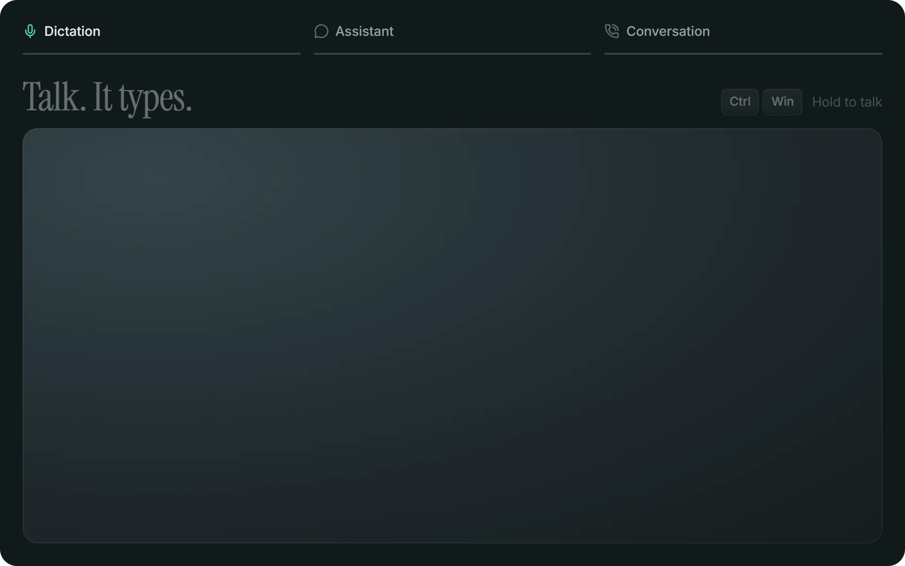
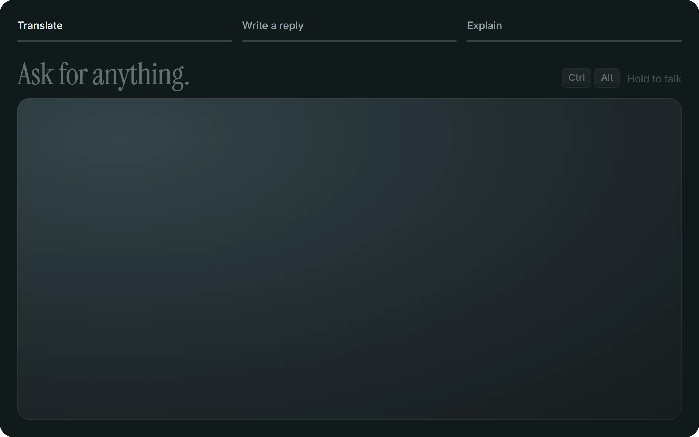
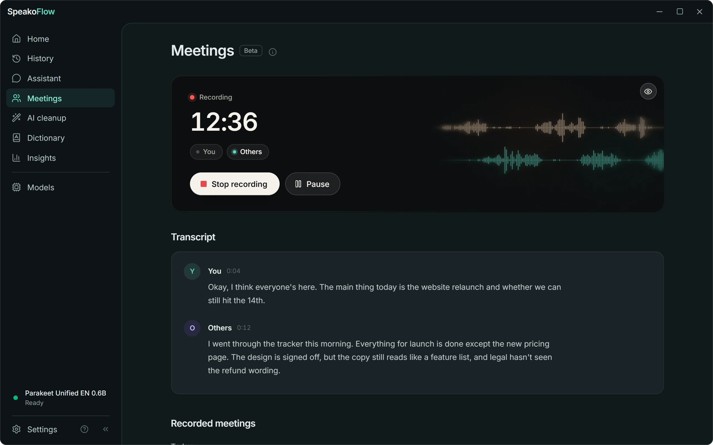
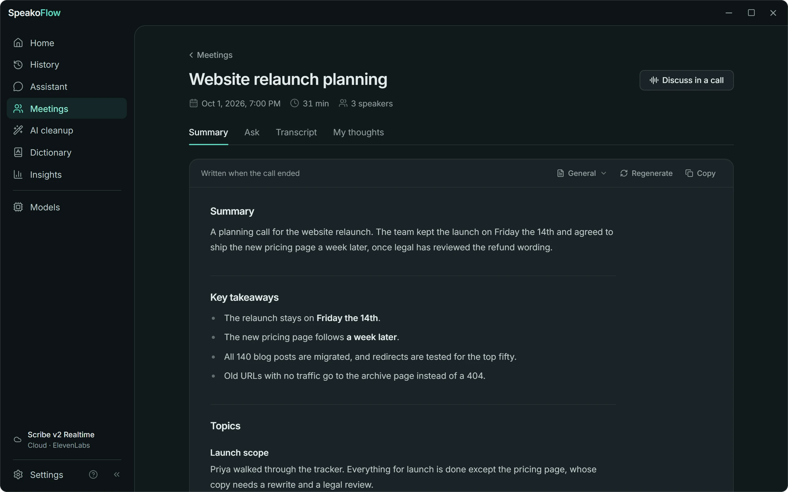
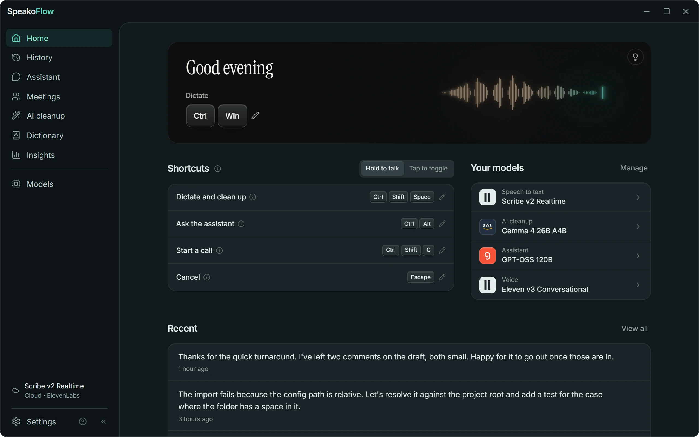
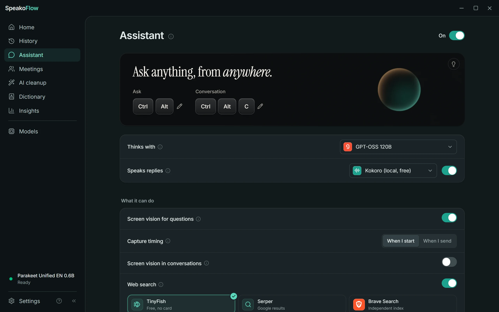
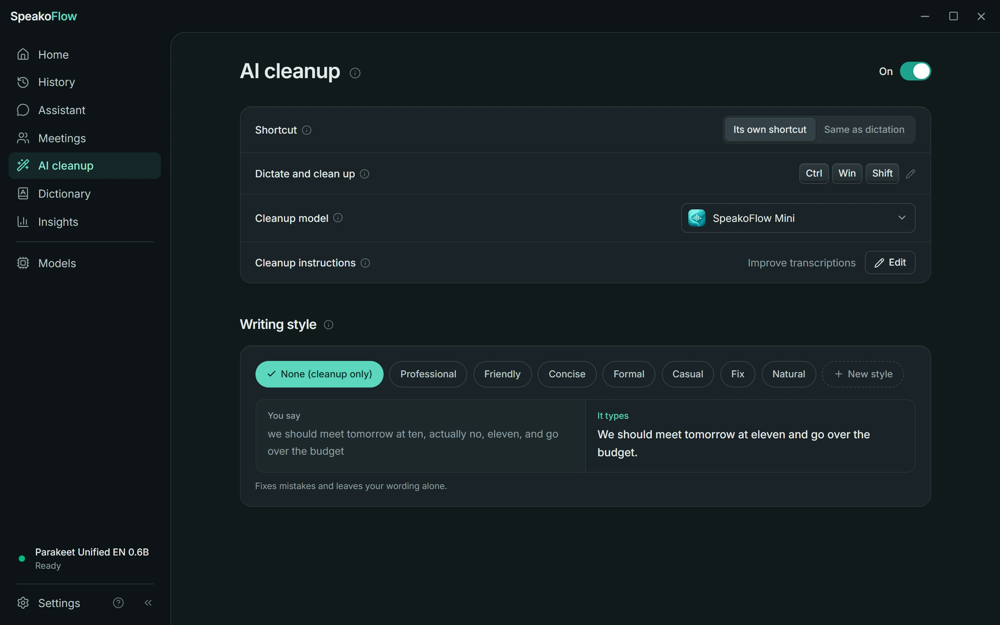
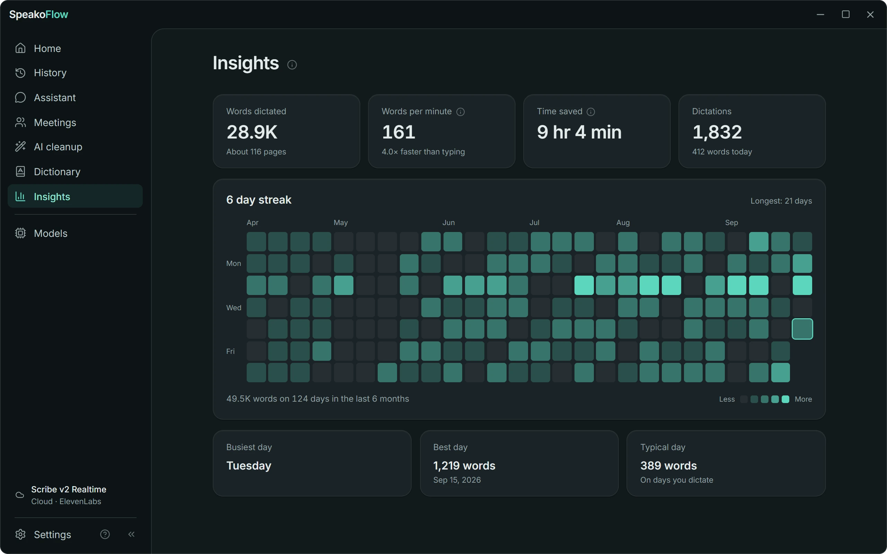
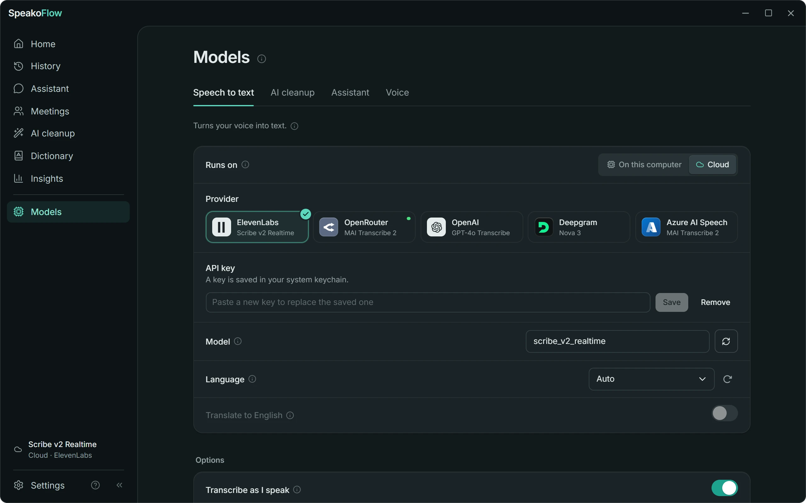
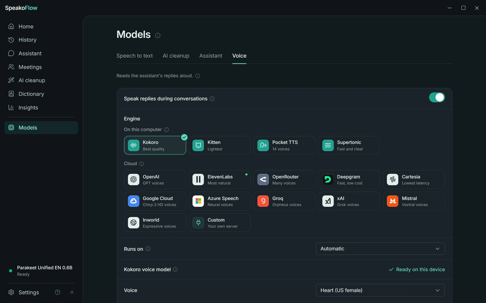

<div align="center">

**English** · [简体中文](README.zh-CN.md) · [繁體中文](README.zh-TW.md)

<picture>
  <source media="(prefers-color-scheme: dark)" srcset="Logo/final-v2/png/lockup-dark-h256.png" />
  
</picture>

# Free voice dictation and an AI assistant for Windows, macOS, and Linux

Talk and it types, in any app. Ask and it answers. Start a conversation and talk it through.<br />
It also writes up your meetings. Free, open source, and local by default.

[](https://github.com/AbhishekBarali/SpeakoFlow/releases/latest)
[](LICENSE)
[](#install)
[](https://tauri.app)



[](https://github.com/AbhishekBarali/SpeakoFlow/releases/latest)
[](https://github.com/AbhishekBarali/SpeakoFlow/releases/latest)
[](https://github.com/AbhishekBarali/SpeakoFlow/releases/latest)

[Website](https://www.speakoflow.com) &nbsp;·&nbsp; [Documentation](https://www.speakoflow.com/docs) &nbsp;·&nbsp; [All releases](https://github.com/AbhishekBarali/SpeakoFlow/releases)

</div>

## What it does

You think faster than you type. SpeakoFlow lets you work with your voice
instead, from any app, with a keyboard shortcut:

<table>
<tr>
<td width="33%" valign="top">

**Dictate**

<kbd>Left Ctrl</kbd> + <kbd>Left Win</kbd>

Hold the keys, talk, let go. What you said is typed at your cursor, in any app
that takes text.

</td>
<td width="33%" valign="top">

**Ask**

<kbd>Left Ctrl</kbd> + <kbd>Left Alt</kbd>

Select some text if you like, then ask out loud. Translate it, reply to it,
explain it. Copy the answer, insert it, or replace the selection.

</td>
<td width="33%" valign="top">

**Converse**

<kbd>Left Ctrl</kbd> + <kbd>Left Alt</kbd> + <kbd>C</kbd>

A hands-free conversation with the assistant. Talk a problem through and it
answers out loud. Press the keys again to end it.

</td>
</tr>
</table>

<sub>Windows defaults. The macOS and Linux keys are under
[Keyboard shortcuts](#keyboard-shortcuts), and you can change every one.</sub>

Speech is transcribed on your own computer unless you pick a cloud service.
The assistant uses whichever model you choose: a built-in one that works
offline, your own Ollama or LM Studio server, or a cloud provider with your own
API key.

I built SpeakoFlow while studying alone for exams. I was paying for a dictation
app that could hear me but couldn't help me, so I made one that does both.

## Features

### Dictation

Hold the keys, talk, and let go. Your words appear wherever the cursor is, and
the recording pill can show them as you speak. Transcription runs on your
graphics card or processor with a local model: Parakeet by default for English,
Nemotron for 28 languages with automatic detection, Whisper for 99, and 65
speech models in the catalog altogether. If you'd rather use the cloud,
ElevenLabs and Deepgram stream text while you talk, and OpenAI, Groq, Mistral,
Azure AI Speech, and OpenRouter work too.

- **Undo.** Cancelled a recording by accident? The pill offers Undo for a few
  seconds, and History keeps the recording so you can recover it later. A
  failed transcription offers Try again.
- **Your words, spelled your way.** Add names and jargon to the Dictionary, or
  write text replacements. On Windows it can learn the words you correct.
- **Translate to English.** Whisper, Canary, Granite Speech, and Voxtral
  models, and OpenAI or Groq in the cloud, can turn speech in another language
  into English text.
- **Hold or tap.** Hold the keys while you talk, or switch to tap so one press
  starts and the next one stops.

### Ask

<div align="center">

</div>

Select some text, or don't. Hold <kbd>Left Ctrl</kbd> + <kbd>Left Alt</kbd> and
say what you want: "translate this to Spanish", "write a polite reply saying I
can't make Thursday", "explain this". The answer streams into a card over the
app you're in, and you can copy it, insert it at the cursor, or put it in
place of the text you selected.

It can do more if you let it:

- **Screen vision.** Ask about the error in your terminal or the chart in your
  spreadsheet. It's off until you switch it on, and even then the model
  decides per question whether it needs to look. A screenshot it doesn't use
  never leaves your computer.
- **Web search** through Serper, Brave, Tavily, Exa, SerpAPI, or TinyFish.
- **Reminders.** "Remind me to send the invoice in twenty minutes." Reminders
  survive a restart and pop up without taking your keyboard.
- **Profiles and memory.** Give it different personas, each with its own reply
  length, and let it remember how you like to work. Memory is off by default,
  stays on your computer, and you can edit or erase it.

### Conversation

Press <kbd>Left Ctrl</kbd> + <kbd>Left Alt</kbd> + <kbd>C</kbd> and talk. The
assistant answers out loud, and you can cut in while it's speaking. Esc stops a
reply without ending the conversation, and pressing the keys again ends it.
Need to type something in the middle? Dictate as usual. The conversation waits
while you do and picks up again afterwards.

Replies are spoken by a voice on your computer (Kokoro, Kitten, Pocket TTS, or
Supertonic) or by a cloud voice from OpenAI, ElevenLabs, Deepgram, Cartesia,
Google, Azure, and others.

### Meetings <sup>beta</sup>

<table>
<tr>
<td width="50%"></td>
<td width="50%"></td>
</tr>
</table>

Press Start recording before a call. SpeakoFlow records your microphone and
your computer's audio as two streams and transcribes them as people speak, so
it always knows which words were yours. No bot joins the meeting, and it works
with any meeting app. On Windows it can offer to record when it notices a call.

When the call ends it writes the notes, with a summary, decisions, and next
steps with owners, using a template you pick (General, Standup, One-on-one,
Interview, or Action items). Other voices are labelled Speaker 1, Speaker 2,
and so on. Afterwards you can ask questions about the meeting, or choose
Discuss this meeting to talk it over in a conversation.

On macOS, recording the other side of a call needs a virtual audio device such
as BlackHole. See [Troubleshooting](#troubleshooting).

### AI cleanup

SpeakoFlow Mini is a small model we trained for one job: turning what you said
into clean text. It removes filler words, fixes grammar and punctuation, and
follows spoken edits, so "scratch that" or "actually, eleven" does what you
meant instead of being typed out. It's a 795 MB download, runs on your
computer, and handles English for now. Any other local or cloud model can do
the job instead, including Apple Intelligence on Apple silicon Macs.

Cleanup is off until you turn it on. It then gets its own shortcut (the
dictation keys plus Shift) or runs on every dictation. On top of it you can add
a writing style: Professional, Friendly, Concise, Formal, Casual, or one you
write yourself.

### Also in the app

- **Insights.** Words dictated, your speaking speed, time saved compared with
  typing at 40 words a minute, and six months of activity with streaks.
- **History.** Your dictations, questions, and conversations. Play a recording
  back, transcribe it again, recover a dismissed one, or
  continue a chat as a conversation. Old recordings can delete themselves after
  a set number, days, or months.
- **Models you already have.** Add a `.gguf` or Whisper `.bin` file, or link a
  folder and every model in it shows up. Nothing is copied or moved. Downloads
  that do happen fetch eight chunks at once and resume where they stopped.
- **Generate with Flow.** Start a dictation with "Hey Flow" and describe what
  you want written, and the finished text is pasted instead of your words. It's
  off by default, under Settings → Dictation.
- **20 interface languages.**

Each feature has its own page in the [documentation](https://www.speakoflow.com/docs).

## A look around

<table>
<tr>
<td width="50%" valign="top"><br /><sub><b>Home.</b> Your shortcuts, the models doing each job, and what you dictated last.</sub></td>
<td width="50%" valign="top"><br /><sub><b>Assistant.</b> Its model, its voice, and what it's allowed to do.</sub></td>
</tr>
<tr>
<td width="50%" valign="top"><br /><sub><b>AI cleanup.</b> Say it messy, get it clean, in the style you pick.</sub></td>
<td width="50%" valign="top"><br /><sub><b>Insights.</b> How much you dictate, and how much typing it saved.</sub></td>
</tr>
<tr>
<td width="50%" valign="top"><br /><sub><b>Models.</b> Each job runs on this computer or in the cloud.</sub></td>
<td width="50%" valign="top"><br /><sub><b>Voices.</b> Four local voices and a dozen cloud ones.</sub></td>
</tr>
</table>

## Keyboard shortcuts

| Action                            | Windows                        | macOS           | Linux                  |
| --------------------------------- | ------------------------------ | --------------- | ---------------------- |
| Dictate                           | `Left Ctrl + Left Win`         | `Fn` (🌐)       | `Ctrl + Space`         |
| Ask the assistant                 | `Left Ctrl + Left Alt`         | `Fn + Ctrl`     | `Ctrl + Alt + Space`   |
| Start or end a conversation       | `Left Ctrl + Left Alt + C`     | `Fn + Ctrl + C` | `Ctrl + Alt + C`       |
| Dictate and clean up <sup>1</sup> | `Left Ctrl + Left Win + Shift` | `Fn + Shift`    | `Ctrl + Shift + Space` |
| Cancel                            | `Esc`                          | `Esc`           | Not available yet      |

<sup>1</sup> Only while AI cleanup is on and has its own shortcut.

The pattern is the same on every platform. Add Shift to the dictation keys to
dictate and clean up, and add C to the ask keys to start a conversation.
Recording shortcuts work while you hold them; switch the Home page from **Hold
to talk** to **Tap to toggle** and one press starts, the next one stops.

Esc only cancels while something is running, like a recording or a reply being
read aloud, so other apps keep their Esc the rest of the time. To change a
shortcut, click its keys. Cancel and the conversation shortcut can also be
turned off from there.

On a Mac, set **System Settings → Keyboard → Press 🌐 key to** to **Do
Nothing**, or the globe key opens the emoji picker as well. Macs that were on
the older Option + Space default keep it after updating.

Scripts and window managers can control SpeakoFlow with
[command-line flags](https://www.speakoflow.com/docs/settings/cli) such as
`--toggle-transcription`.

## Models and providers

Every job can run on your computer or with a provider you choose. Cloud
providers use your own API key, stored in your system keychain.

| Job                   | On your computer                                                                                                                                        | In the cloud, with your key                                                                                                                                                                               |
| --------------------- | ------------------------------------------------------------------------------------------------------------------------------------------------------- | --------------------------------------------------------------------------------------------------------------------------------------------------------------------------------------------------------- |
| Speech to text        | Parakeet, Nemotron, Canary, Cohere Transcribe, Whisper, Moonshine, Voxtral, Qwen3-ASR, GigaAM, Granite Speech, SenseVoice, and more (65 in the catalog) | ElevenLabs, Deepgram, OpenAI, Groq, Mistral (Voxtral), Azure AI Speech, OpenRouter, or any OpenAI-compatible server                                                                                       |
| Assistant and cleanup | Built-in engine (llama.cpp, fully offline), Ollama, LM Studio, SpeakoFlow Mini for cleanup, Apple Intelligence for cleanup on Apple silicon             | OpenAI, Anthropic, Google Gemini, Azure OpenAI, AWS Bedrock, OpenRouter, Groq, Cerebras, xAI, DeepSeek, Mistral, Moonshot, Together AI, Fireworks AI, Perplexity, Z.AI, or any OpenAI-compatible endpoint |
| Spoken replies        | Kokoro, Kitten, Pocket TTS, Supertonic                                                                                                                  | OpenAI, ElevenLabs, OpenRouter, Deepgram, Cartesia, Google Cloud, Azure AI Speech, Groq, xAI, Mistral, Inworld, or your own server                                                                        |
| Web search (optional) |                                                                                                                                                         | Serper, Brave, Tavily, Exa, SerpAPI, TinyFish                                                                                                                                                             |

## Privacy

By default your voice is transcribed on your computer and never uploaded. There
is no telemetry, no analytics, and no account.

Data leaves your computer only for things you set up yourself:

- **A cloud speech service**, if you pick one instead of a local model. It
  receives your recordings.
- **The assistant's provider**, if it isn't a local one. It receives your
  questions, any text you selected, a screenshot when screen vision is on and
  the model asks for one, and a meeting's transcript when you generate notes or
  ask about it.
- **Web search**, if you turn it on. The search provider receives the query.
- **Feedback**, if you send it from the app. It sends exactly what the dialog
  shows you, to a private issue tracker only the developer can read.

API keys live in your system keychain. Memory is off until you turn it on, and
it stays on your computer where you can view, edit, or erase it. More detail is
on the [privacy page](https://www.speakoflow.com/docs/reference/privacy).

## Install

Download the latest build from the
[Releases](https://github.com/AbhishekBarali/SpeakoFlow/releases) page. On
first launch you pick a speech model, and a short tour shows the shortcuts
while it downloads.

Already on 1.4 or earlier? Those versions can't update themselves to 2.0, so
download 2.0 once from Releases and install it over the old one. Your settings
and history are kept. From 2.0 on, updates install from inside the app.

### Windows

Run the `.exe` installer. Windows may show a SmartScreen notice because the
installer isn't signed by a known publisher yet; choose **More info → Run
anyway**.

### macOS

Download the `.dmg` for your Mac (`aarch64` for Apple silicon, `x64` for Intel)
and drag **SpeakoFlow** into Applications. The app isn't signed by Apple yet,
so macOS says it "is damaged and can't be opened". It isn't damaged. Clear the
block once with this command in Terminal, then open the app normally:

```bash
xattr -dr com.apple.quarantine /Applications/SpeakoFlow.app
```

SpeakoFlow then asks for **Microphone** and **Accessibility** permission so it
can hear you and type into other apps.

<details>
<summary>More about the macOS install</summary>

<br />

The "damaged" message is what macOS shows for any app it can't trace to a paid
Apple Developer account. Signing costs $99 a year, which this project doesn't
have yet. macOS 15 and later removed the old right-click → **Open** bypass, and
this message is the one case where System Settings offers no **Open Anyway**
button, so Terminal is the only way through. The command removes the
"downloaded from the internet" tag from that copy of the app.

You run it once per download. Updates installed from inside the app aren't
tagged, so they don't need it. If you download a new `.dmg` by hand, run it
again for that copy.

After an update, macOS sometimes keeps showing SpeakoFlow as allowed under
Accessibility, Microphone, or Screen Recording while no longer honouring it. If
a permission screen keeps waiting, use its **Reset permission** button, then
switch SpeakoFlow on again in System Settings.

The Intel build needs macOS 14 Sonoma or later. It runs on the processor only,
so transcription is slower than on Apple silicon, but everything works. CI
launches every Intel build on a real Intel Mac before it's released.

</details>

### Linux

- **Arch Linux.** Install `speakoflow-bin` from the AUR, for example with
  `yay -S speakoflow-bin`.
- **Debian 13+, Ubuntu 24.04+, Mint 22+, Pop!\_OS.** Install the `.deb`, which
  also adds the app icon and menu entry:
  ```bash
  sudo apt install ./SpeakoFlow_*_amd64.deb
  ```
- **Other distributions, including Fedora and openSUSE.** Use the AppImage:
  make it executable with `chmod +x` and run it. Tools like Gear Lever or
  AppImageLauncher add it to your app menu.

Both packages are built for x86_64 and ARM64 on Ubuntu 24.04, so they need
glibc 2.39 or newer. That rules out Ubuntu 22.04, Debian 12, Mint 21, and
RHEL 9 and its rebuilds. There's no `.rpm` yet, because the packaging doesn't
bundle the speech engine correctly, and a package that installs but can't
transcribe would be worse than none.

### Updates

SpeakoFlow checks for new versions in the background and installs them from
Settings → About, after verifying each one against the project's signing key.
The AUR package updates through your package manager instead. To hear about
releases on GitHub, click **Watch → Custom → Releases** at the top of this
page.

## Build from source

You need [Rust](https://rustup.rs/) and [Bun](https://bun.sh/).

```bash
git clone https://github.com/AbhishekBarali/SpeakoFlow.git
cd SpeakoFlow
bun install
mkdir -p src-tauri/resources/models
curl -o src-tauri/resources/models/silero_vad_v4.onnx https://blob.handy.computer/silero_vad_v4.onnx
bun run tauri dev
```

On Arch-based distributions, `bun run install:arch` builds the current checkout
and installs it under `~/.local` with a desktop entry and a `speak` command.
[BUILD.md](BUILD.md) has the setup for each platform.

The app is [Tauri 2](https://tauri.app) with a Rust backend and a React and
TypeScript frontend. Speech runs on transcribe.cpp, whisper.cpp, and ONNX
Runtime with Silero VAD; the assistant and cleanup on a bundled llama.cpp
engine or any OpenAI-compatible API; local voices on [Kokoro](https://github.com/hexgrad/kokoro)
in the app's window and [sherpa-onnx](https://github.com/k2-fsa/sherpa-onnx)
on the processor; and meeting speaker labels on WeSpeaker voice embeddings.

## How it compares

|                     | SpeakoFlow | Wispr Flow                                               | Superwhisper                                  | Handy      |
| ------------------- | ---------- | -------------------------------------------------------- | --------------------------------------------- | ---------- |
| Price               | Free       | Free up to 2,000 words a week on desktop, then $15/month | Free tier, Pro at $8.49/month or $249.99 once | Free       |
| Source code         | Open (MIT) | Closed                                                   | Closed                                        | Open (MIT) |
| Linux               | Yes        | No                                                       | No                                            | Yes        |
| Transcribes offline | Yes        | No                                                       | Yes                                           | Yes        |
| AI assistant        | Yes        | Yes                                                      | No                                            | No         |

<sub>Prices and platforms from each product's own site, checked October 2026.</sub>

SpeakoFlow's dictation core comes from [Handy](https://github.com/cjpais/Handy),
which is a good choice if dictation is all you need. More detail:
[SpeakoFlow vs Wispr Flow](https://www.speakoflow.com/blog/speakoflow-vs-wispr-flow)
and [free and open-source Wispr Flow alternatives](https://www.speakoflow.com/blog/best-free-open-source-wispr-flow-alternatives).

## Troubleshooting

The common problems are below. For anything else, see the
[troubleshooting docs](https://www.speakoflow.com/docs/reference/troubleshooting)
or [open an issue](https://github.com/AbhishekBarali/SpeakoFlow/issues).

<details>
<summary><b>macOS: a meeting only records my side of the call</b></summary>

<br />

macOS gives apps no direct way to record the sound your computer plays. Windows
has WASAPI loopback and Linux has your PulseAudio or PipeWire monitor source,
but a Mac needs a virtual audio device in between.

Install a loopback driver such as [BlackHole](https://github.com/ExistentialAudio/BlackHole),
create a Multi-Output Device in Audio MIDI Setup that sends sound to both your
speakers and BlackHole, and make it your output. SpeakoFlow can then record the
other side of the call. Your microphone is recorded either way.

</details>

<details>
<summary><b>Linux: the recording overlay won't stay on top of other apps</b></summary>

<br />

A window can only float above the others on Linux through the `wlr-layer-shell`
protocol (wlroots compositors like Sway and Hyprland, and KDE Plasma) or X11
"keep above" stacking. Native GNOME on Wayland supports neither, so when
SpeakoFlow detects it, it runs under XWayland, where the overlay floats
normally. That needs no setup, and X11 and KDE or wlroots Wayland work as they
are.

- To force native Wayland anyway, launch with `SPEAKOFLOW_ALLOW_WAYLAND=1`. The
  overlay may not stay on top.
- If the overlay misbehaves under a layer-shell compositor, launch with
  `SPEAKOFLOW_NO_GTK_LAYER_SHELL=1`.

</details>

<details>
<summary><b>Linux: shortcuts do nothing and the log repeats "Permission denied"</b></summary>

<br />

A log full of `rdev grab error: ... PermissionDenied` means the app can't read
your input devices. This only affects the **SpeakoFlow Keys** keyboard engine,
which reads `/dev/input/event*` (needs your user in the `input` group) and
re-sends keys through `/dev/uinput` (root-only by default on many
distributions, Ubuntu included, so the group alone is not enough). Tauri is the default engine on Linux, so you'd only
see this after switching. The **Shortcuts** card on the Home page says when
this is the case and gives the exact command.

- Grant both, then log out and back in:
  ```bash
  sudo usermod -aG input "$USER"
  echo 'KERNEL=="uinput", GROUP="input", MODE="0660"' | sudo tee /etc/udev/rules.d/70-speakoflow-uinput.rules
  sudo udevadm control --reload && sudo udevadm trigger /dev/uinput
  ```
- Or switch the keyboard engine back to **Tauri** in Settings → Advanced. It
  needs no permissions but registers shortcuts through X11, so on native
  Wayland it only hears them while an X11 window has focus.

On Wayland the dependable option is a shortcut owned by your desktop. On a
Wayland session the Shortcuts card shows a **Set up** button that lists the
command for each action, ready to copy. Add a custom shortcut in GNOME or KDE
settings, or a `bind` line in Sway or Hyprland, that runs
`speakoflow --toggle-transcription` (for an AppImage, its path followed by the
same flag). `--toggle-post-process`, `--toggle-assistant`, `--toggle-call`
(start or end a conversation), and `--cancel` work the same way. These start
with one press and stop with the next, like **Tap to toggle**.

</details>

<details>
<summary><b>Linux: the app crashes on a touchpad pinch-to-zoom</b></summary>

<br />

A crash with `Received invalid message: 'DrawingArea_CommitTransientZoom'` in
the log is a WebKitGTK bug that affects many apps built on it, tracked in
[tauri#13115](https://github.com/tauri-apps/tauri/issues/13115) and
[wry#544](https://github.com/tauri-apps/wry/issues/544). Until it's fixed
upstream, avoid pinching inside the window. Updating `webkit2gtk-4.1` to the
latest version can help.

</details>

## Roadmap

- Code signing for Windows and macOS
- More one-click local models
- More community translations
- Dictation tuned for agentic coding
- Help writing prompts: describe what you want to build and get a solid prompt back
- Voice commands that take actions for you

## Contributing

Contributions are welcome. [CONTRIBUTING.md](CONTRIBUTING.md) explains how to
get started, and [CONTRIBUTING_TRANSLATIONS.md](CONTRIBUTING_TRANSLATIONS.md)
covers translating the app.

Found a bug or have an idea? Use **Send feedback** in the app (the **?** next
to Settings), or [open an issue](https://github.com/AbhishekBarali/SpeakoFlow/issues).

## License and credits

SpeakoFlow is released under the [MIT License](LICENSE).

The dictation core comes from [Handy](https://github.com/cjpais/Handy) by CJ
Pais, used under the MIT licence. Thanks to CJ for making it open. The
assistant, conversations, meetings, screen vision, Generate with Flow,
translation, spoken replies, and memory are SpeakoFlow's own.

Thanks also to [Tauri](https://tauri.app), whisper.cpp, llama.cpp, ONNX Runtime,
[sherpa-onnx](https://github.com/k2-fsa/sherpa-onnx), Silero VAD, WeSpeaker,
[Kokoro](https://github.com/hexgrad/kokoro), and Kyutai's Pocket TTS.

Cloud transcription uploads are compressed with the [LAME](https://lame.sourceforge.io)
MP3 encoder, via [mp3lame-encoder](https://github.com/DoumanAsh/mp3lame-encoder).
Both are LGPL-3.0 and are statically linked; their source, and this app's, are
public, so a build against a modified LAME is always possible.

<div align="center">

Made by [Abhishek Barali](https://github.com/AbhishekBarali) · [speakoflow.com](https://www.speakoflow.com)

</div>
